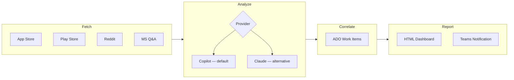

# Voice of Customer — Outlook

An automated AI-powered pipeline that collects customer feedback from multiple sources, analyzes it using pluggable AI providers (GitHub Copilot or Claude), correlates findings with Azure DevOps bugs, and publishes a live dashboard — every day at 6 AM UTC.

**Live Dashboard:** [vinodh-g-ms.github.io/voice-of-customer](https://vinodh-g-ms.github.io/voice-of-customer/)

---

## What It Does

| Step | Action | Details |
|------|--------|---------|
| **Fetch** | Collects ~2,900 reviews daily | App Store (iOS + Mac), Google Play (Android), Reddit, Microsoft Q&A |
| **Analyze** | AI clusters feedback (Copilot/Claude) | Sentiment scoring, topic clustering, severity ranking, trend analysis |
| **Correlate** | Links to engineering work | Searches ADO Outlook Mobile project for matching bugs |
| **Report** | Publishes live dashboard | Self-contained HTML on GitHub Pages + Teams notification |

## Platforms & Sources

| Platform | Sources | Typical Volume |
|----------|---------|---------------|
| iOS | App Store, Reddit, MS Q&A | ~1,350 reviews |
| macOS | App Store, Reddit, MS Q&A | ~450 reviews |
| Android | Google Play, Reddit, MS Q&A | ~1,100 reviews |

## Architecture

**Pattern:** Batch ETL Pipeline + Static Site Generation

```
Fetch (4 sources) → Analyze (AI — Copilot/Claude) → Correlate (ADO) → Report (HTML + Teams)
```



- **Schedule:** GitHub Actions cron, daily 6 AM UTC (with automatic retry on failure)
- **AI Providers:** Pluggable — GitHub Copilot (default) or Claude (Anthropic API)
- **Hosting:** GitHub Pages (static HTML)
- **Notifications:** Microsoft Teams via Incoming Webhook (failure-aware)
- **Bug Linking:** Azure DevOps Work Item Search API + manual linking via `manual_links.json`

## AI Analysis Providers

The pipeline supports two AI providers for the analysis phase. Set the `ANALYSIS_PROVIDER` env var (or GitHub Actions variable) to switch.

### GitHub Copilot (Default)

| Setting | Value |
|---------|-------|
| **Provider** | `ANALYSIS_PROVIDER=copilot` |
| **Model** | `gpt-5.4` (GPT-5.4 by OpenAI) |
| **API Endpoint** | `https://api.githubcopilot.com/responses` |
| **Auth** | `GITHUB_TOKEN` or `GH_MODELS_TOKEN` (Bearer token) |
| **Context Window** | 400K tokens |
| **Max Output** | 128K tokens |
| **Max Reviews/Batch** | 500 |

GPT-5.4 uses the OpenAI **Responses API** (`/responses`), not the Chat Completions API. The pipeline detects `gpt-5.x` models and automatically uses the correct endpoint format.

**Available models** (configurable via `COPILOT_MODEL` env var):
- `gpt-5.4` — most capable (default)
- `gpt-5.4-mini` — fast + capable, lower cost
- `gpt-4.1` — previous gen (uses `/chat/completions` via `models.inference.ai.azure.com`)

### Claude (Alternative)

| Setting | Value |
|---------|-------|
| **Provider** | `ANALYSIS_PROVIDER=claude` |
| **Model** | `claude-haiku-4-5-20251001` (Claude Haiku 4.5) |
| **API Endpoint** | `https://api.anthropic.com/v1/messages` |
| **Auth** | `ANTHROPIC_API_KEY` (x-api-key header) |
| **Context Window** | 200K tokens |
| **Max Output** | 64K tokens |
| **Max Reviews/Batch** | 500 |

Uses the Anthropic **Messages API**. Upgrade to `claude-sonnet-4-20250514` or `claude-opus-4-20250514` if your API key has access to higher tiers.

### Switching Providers

```bash
# Local: use Copilot (default)
export GITHUB_TOKEN=$(gh auth token)
python main.py

# Local: use Claude
export ANALYSIS_PROVIDER=claude
export ANTHROPIC_API_KEY="sk-ant-..."
python main.py
```

In GitHub Actions, set the `ANALYSIS_PROVIDER` repository variable at [Settings → Variables → Actions](https://github.com/vinodh-g-ms/voice-of-customer/settings/variables/actions).

## Data Sources — How Reviews Are Fetched

### App Store (iOS + macOS)

| Setting | Value |
|---------|-------|
| **Method** | Apple iTunes RSS JSON feed (public, no auth) |
| **Endpoint** | `https://itunes.apple.com/{country}/rss/customerreviews/id={app_id}/sortBy=mostRecent/page={page}/json` |
| **App IDs** | iOS: `951937596`, macOS: `985367838` |
| **Countries** | US, GB, AU, CA, IN |
| **Pages** | Up to 10 per country (50 reviews/page) |
| **Rate Limit** | 1.1s delay between requests |

### Google Play Store (Android)

| Setting | Value |
|---------|-------|
| **Method** | `google-play-scraper` Python library (scrapes Play Store) |
| **App ID** | `com.microsoft.office.outlook` |
| **Countries** | US, GB, AU, CA, IN |
| **Reviews/Country** | 200 |
| **Auth** | None required |

### Reddit

Reddit blocks datacenter IPs, so the pipeline uses a **3-level fallback chain**:

| Priority | Method | Endpoint | Auth |
|----------|--------|----------|------|
| 1st | JSON API | `https://www.reddit.com/r/{sub}/search.json` | None (User-Agent only) |
| 2nd | Web scraping | `https://old.reddit.com/r/{sub}/search` (parsed with BeautifulSoup) | None |
| 3rd | Arctic Shift archive | `https://arctic-shift.photon-reddit.com/api/posts/search` | None |

- **Subreddits:** r/Outlook, r/microsoft365, r/Office365
- **Queries:** Platform-specific (e.g., `outlook ios OR outlook iphone OR outlook mobile`)
- **Rate Limit:** 6s delay between subreddits
- In CI (GitHub Actions), the JSON API and scraping both return 403 — Arctic Shift is what actually works

### Microsoft Q&A

| Setting | Value |
|---------|-------|
| **Method** | Web scraping with BeautifulSoup (HTML parsing) |
| **Endpoint** | `https://learn.microsoft.com/en-us/answers/tags/456/outlook-mobile?page={n}&orderby=newest` |
| **Pages** | Up to 5 pages |
| **Auth** | None required |
| **Rate Limit** | 1.5s delay between pages |

## Quick Start

### Run Locally

```bash
# Install dependencies
pip install -r requirements.txt

# Run full pipeline (default: Copilot provider, requires GITHUB_TOKEN)
export GITHUB_TOKEN="ghp_..."
export ANALYSIS_PROVIDER=copilot
python main.py

# Or use Claude as the AI provider instead
export ANALYSIS_PROVIDER=claude
export ANTHROPIC_API_KEY="sk-ant-..."
python main.py

# Run for a single platform
python main.py --platforms ios

# Skip ADO correlation (no PAT needed)
python main.py --skip-ado

# Use cached data (faster re-runs)
python main.py  # automatically uses 12-hour cache
```

### CLI Options

| Flag | Description | Example |
|------|-------------|---------|
| `--platforms` | Comma-separated platforms | `--platforms ios,mac` |
| `--sources` | Comma-separated sources | `--sources appstore,reddit` |
| `--topic` | Focus analysis on a topic | `--topic "calendar sync"` |
| `--skip-ado` | Skip ADO bug correlation | `--skip-ado` |
| `--no-cache` | Force fresh data fetch | `--no-cache` |

### Output

```
output_v3/
  pulse_dashboard_v3.html   # Interactive HTML dashboard (~495KB, self-contained)
  pulse_report_v3_{ts}.md   # Markdown report for archival
  architecture.html          # Architecture documentation page
```

## GitHub Actions Pipeline

The pipeline runs automatically via `.github/workflows/daily-voc.yml`:

1. **Install dependencies** — Python 3.11 + pip
2. **Run VoC Pipeline** — with automatic retry (5-min delay + `--no-cache` on second attempt)
3. **Send Teams Notification** — failure-aware Adaptive Card (shows retry status, failure details, re-run button)
4. **Upload Artifact** — Saves output for 30 days
5. **Deploy to GitHub Pages** — Pushes dashboard to `gh-pages` branch

### Retry Mechanism

If the pipeline fails on the first attempt (e.g., transient API error), it:
1. Waits **5 minutes** for the issue to resolve
2. Retries with `--no-cache` (fresh data)
3. Only deploys the error dashboard if **both attempts fail**

Teams notification reflects the actual outcome: `success`, `succeeded after retry`, or `failed` (with a "Re-run Pipeline" button).

### Required Secrets

| Secret | Purpose | Required? |
|--------|---------|-----------|
| `GITHUB_TOKEN` | GitHub Copilot (Models API) access | **Yes** (default provider) |
| `ANTHROPIC_API_KEY` | Claude AI API access | Only if `ANALYSIS_PROVIDER=claude` |
| `ADO_PAT` | Azure DevOps bug search | Optional (expires every 7 days) |
| `TEAMS_WEBHOOK_URL` | Teams channel notifications | Optional |

Configure at: [Settings → Secrets → Actions](https://github.com/vinodh-g-ms/voice-of-customer/settings/secrets/actions)

### Manual ADO Bug Linking

You can manually link ADO bugs to dashboard clusters. These links persist across pipeline runs even when Claude/GPT generates slightly different topic names.

**How to link a bug:**
1. Click **"Link Existing ADO Bug"** on any cluster card in the dashboard
2. The cluster topic is copied to your clipboard
3. The GitHub Actions workflow form opens — paste the topic, select platform, enter the ADO bug ID
4. The workflow commits to `manual_links.json` and triggers a dashboard refresh

**How it works internally:**
- Links are stored in `manual_links.json` in the repo
- During correlation, the pipeline fuzzy-matches stored topics to current clusters (keyword overlap + sequence similarity)
- Linked bugs show as "pinned" at the top of the ADO section with real title, state, and assignee fetched from ADO
- Links auto-expire after 90 days (configurable via `retention_days` in `manual_links.json`)

### When Something Breaks

If the pipeline fails (usually an expired token), it automatically generates an **error dashboard** with:
- Health check table showing which integrations are down
- Step-by-step fix instructions (no coding required)
- Direct links to update secrets and re-run the pipeline

## Project Structure

```
├── main.py                 # Pipeline orchestrator
├── analysis.py             # AI analysis & trend computation (pluggable provider)
├── analyzers/
│   ├── __init__.py         # Provider factory (get_analyzer)
│   ├── base.py             # Abstract base class + shared prompts
│   ├── claude_analyzer.py  # Anthropic Claude implementation (Messages API)
│   └── copilot_analyzer.py # GitHub Copilot implementation (Responses API + Chat Completions)
├── report.py               # HTML dashboard & markdown generation
├── models.py               # Data classes (Review, TopicCluster, PulseReport)
├── config.py               # App IDs, API endpoints, model config, constants
├── cache.py                # 12-hour TTL file cache
├── ado_search.py           # Azure DevOps Work Item Search + manual link matching
├── manual_links.json       # User-pinned ADO bug links (persists across runs)
├── error_dashboard.py      # Error page generator (self-healing UX)
├── notify_teams.py         # Teams webhook notification (failure-aware)
├── upload_to_sharepoint.py # SharePoint upload (optional)
├── requirements.txt        # Python dependencies
├── sources/
│   ├── appstore.py         # Apple App Store RSS feed
│   ├── playstore.py        # Google Play Store scraper
│   ├── reddit.py           # Reddit (JSON API → scraping → Arctic Shift archive)
│   └── msqa.py             # Microsoft Q&A scraper
└── .github/
    └── workflows/
        ├── daily-voc.yml       # Daily pipeline (with retry)
        └── link-ado-bug.yml    # Manual ADO bug linking workflow
```

## Contributing

1. Fork this repo
2. Make changes
3. Test locally: `python main.py --platforms ios --skip-ado`
4. Submit a pull request

Common contributions:
- **Add a data source** — Create a new file in `sources/`, return `list[Review]`
- **Update tokens** — Go to Settings → Secrets (no code needed)
- **Improve the dashboard** — Modify `report.py`

## Owner

**Vinodhswamy** — Outlook Team
